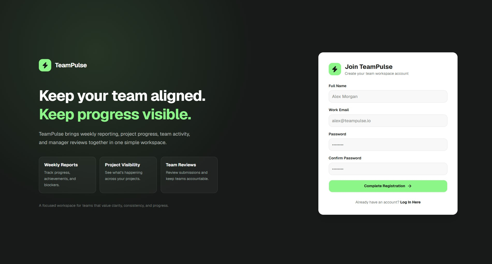
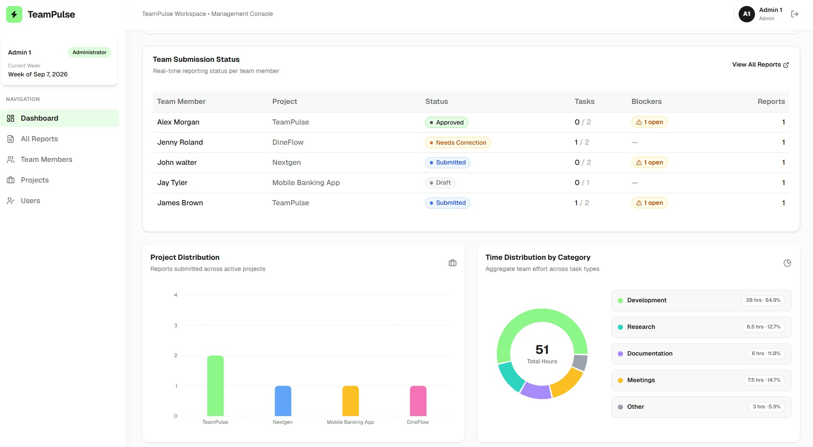
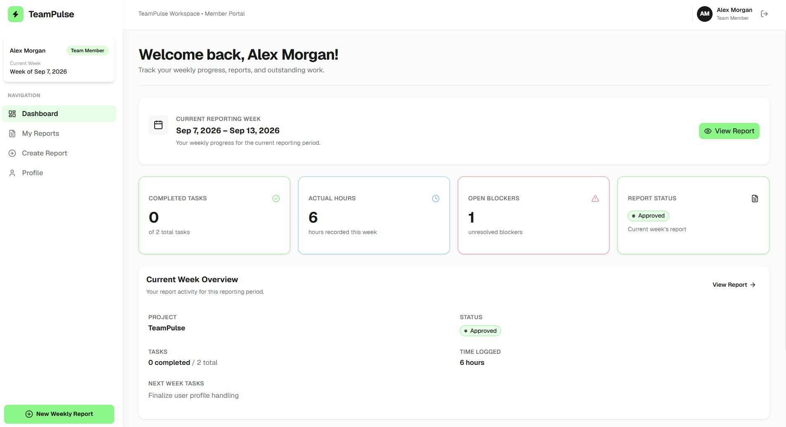

# TeamPulse

A full-stack Weekly Report Generator and Team Dashboard for managing weekly employee reports, reviews, corrections, and team progress.

## Tech Stack

### Frontend

* React
* TypeScript
* Vite
* Tailwind CSS
* Zustand
* Axios
* React Router
* Zod

### Backend

* Java 21
* Spring Boot
* Spring Security
* JWT Authentication
* Spring Data JPA
* Hibernate
* Gradle

### Database

* PostgreSQL

### SignUp


### Admin Dashboard


### Team Member Dashboard


---

# Setup & Run

Follow the steps below to set up and run TeamPulse locally.

## Prerequisites

Make sure the following are installed:

* Java 21
* Node.js 18+
* npm
* PostgreSQL 14+
* Git

Verify the installations:

```bash
java -version
node -v
npm -v
psql --version
git --version
```

---

## 1. Clone the Repository

```bash
git clone https://github.com/Sithija-R/TeamPulse.git
```

---

## 2. Configure PostgreSQL

TeamPulse uses PostgreSQL as its relational database.

### Create the Database

Open PostgreSQL using `psql` or pgAdmin and create the database:

```sql
CREATE DATABASE teampulse;
```

Optionally, create a dedicated PostgreSQL user:

```sql
CREATE USER teampulse_user WITH PASSWORD 'your_password';
```

Grant access to the database:

```sql
GRANT ALL PRIVILEGES ON DATABASE teampulse TO teampulse_user;
```

Make sure PostgreSQL is running before starting the backend.

---

## 3. Configure the Backend

Navigate to the backend directory:

```bash
cd backend
```

Create a `.env` file inside the `backend` directory:

```env
DB_URL=jdbc:postgresql://localhost:5432/teampulse
DB_USERNAME=teampulse_user
DB_PASSWORD=your_password

JWT_SECRET=your-secret-key
JWT_EXPIRATION=86400000
```
---

## 4. Run the Backend

From the `backend` directory, build the project.

### Windows

```bash
gradlew.bat build
```

### Linux/macOS

```bash
./gradlew build
```

Start the Spring Boot application.

### Windows

```bash
gradlew.bat bootRun
```

### Linux/macOS

```bash
./gradlew bootRun
```

The backend will run at:

```text
http://localhost:8080
```

API base URL:

```text
http://localhost:8080/api
```

---

## 5. Configure the Frontend

Open a new terminal and navigate to the frontend:

```bash
cd frontend
```

Install the required dependencies:

```bash
npm install
```

Create a `.env` file inside the `frontend` directory:

```env
VITE_API_BASE_URL=http://localhost:8080/api
```

The frontend uses this variable to communicate with the Spring Boot backend.

---

## 6. Run the Frontend

Start the Vite development server:

```bash
npm run dev
```

The frontend will normally be available at:

```text
http://localhost:5173
```

---

## 7. Run the Complete Application

Start the application components in the following order.

### 1. PostgreSQL

Make sure PostgreSQL is running and the `teampulse` database exists.

### 2. Backend

From the `backend` directory:

**Windows:**

```bash
gradlew.bat bootRun
```

**Linux/macOS:**

```bash
./gradlew bootRun
```

### 3. Frontend

Open another terminal:

```bash
cd frontend
npm install
npm run dev
```

Then open:

```text
http://localhost:5173
```

---

## Local Development Configuration

| Component  | URL                         |
| ---------- | --------------------------- |
| Frontend   | `http://localhost:5173`     |
| Backend    | `http://localhost:8080`     |
| API        | `http://localhost:8080/api` |
| PostgreSQL | `localhost:5432`            |
| Database   | `teampulse`                 |

---

# Features

## Authentication & Authorization

* User registration and login
* JWT-based authentication
* Password encryption using BCrypt
* Role-based access control
* Stateless authentication
* Protected API endpoints
* Frontend route protection
* Roles:

  * `TEAM_MEMBER`
  * `MANAGER`
  * `ADMIN`

---

## Team Member

* Personal dashboard
* Create weekly reports
* Save reports as drafts
* Edit draft reports
* Submit reports
* Resubmit reports after corrections
* View report history
* View report details
* View review history
* View report version history
* Manage personal profile

---

## Manager / Admin

* Management dashboard
* View all team reports
* Filter reports by:

  * Member
  * Project
  * Status
  * Date
* Review submitted reports
* Approve reports
* Request corrections
* View review history
* View report versions
* View team member status
* Manage projects
* Manage users and roles

---

## Dashboard & Analytics

* Weekly report statistics
* Submission compliance rate
* Report status overview
* Team member status
* Project distribution
* Time distribution by task type
* Open blockers
* Recent review activity

---

# Project Structure

```text
TeamPulse/
├── frontend/
│   ├── src/
│   ├── package.json
│   └── ...
│
├── backend/
│   ├── src/
│   ├── build.gradle.kts
│   └── ...
│
└── README.md
```

---

# Application Workflow

```text
Register / Login
       ↓
User Dashboard
       ↓
Create Weekly Report
       ↓
Save as Draft
       ↓
Submit Report
       ↓
Manager Review
       ↓
 ┌───────────────┐
 │               │
Approve     Request Changes
 │               │
 ↓               ↓
Approved    Needs Correction
                 ↓
             Edit Report
                 ↓
             Resubmit
                 ↓
            Manager Review
```

---

# User Roles

| Role          | Access                                                       |
| ------------- | ------------------------------------------------------------ |
| `TEAM_MEMBER` | Personal dashboard, reports, profile                         |
| `MANAGER`     | Management dashboard, team reports, reviews, projects, users |
| `ADMIN`       | Management dashboard, team reports, reviews, projects, users |

---

# Main API Endpoints

## Authentication

```text
POST /api/auth/register
POST /api/auth/login
```

---

## Users

```text
GET   /api/users
GET   /api/users/{id}
PATCH /api/users/{id}/role
```

---

## Projects

```text
GET    /api/projects
GET    /api/projects/{id}
POST   /api/projects
PUT    /api/projects/{id}
DELETE /api/projects/{id}
```

---

## Reports

```text
POST   /api/reports
GET    /api/reports/my
GET    /api/reports/{id}
PUT    /api/reports/{id}
DELETE /api/reports/{id}
POST   /api/reports/{id}/submit
GET    /api/reports
```

The management report endpoint supports filtering by member, project, and status:

```text
GET /api/reports?memberId=1&projectId=2&status=SUBMITTED
```

Date filters can also be provided:

```text
GET /api/reports?startDate=2026-08-01&endDate=2026-08-31
```

---

## Reviews

```text
POST /api/reports/{id}/review
GET  /api/reports/{id}/reviews
```

---

## Report Versions

```text
GET /api/reports/{id}/versions
GET /api/reports/{id}/versions/{versionNumber}
```

---

## Dashboard

```text
GET /api/dashboard
GET /api/dashboard?weekStartDate=2026-08-31
```

---

# Report Status Workflow

```text
DRAFT
  ↓
SUBMITTED
  ↓
 ┌──────────────────┐
 │                  │
APPROVED      NEEDS_CORRECTION
                    ↓
                  EDIT
                    ↓
                SUBMITTED
                    ↓
                APPROVED
```

A new report version is created each time a report is submitted.

---

# Architecture

TeamPulse follows a layered Spring Boot architecture.

```text
                    React Frontend
                          │
                          │ REST API
                          ↓
                  Spring Boot Backend
                          │
        ┌─────────────────┼─────────────────┐
        │                 │                 │
   Controllers        Services        Security / JWT
        │                 │
        ↓                 ↓
      DTOs          Repositories
                          │
                          ↓
                       Hibernate
                          │
                          ↓
                      PostgreSQL
```

### Backend Layers

* **Controllers** — Handle HTTP requests and responses.
* **Services** — Contain business logic.
* **Repositories** — Handle database access using Spring Data JPA.
* **Models/Entities** — Represent database entities.
* **DTOs** — Define API request and response structures.
* **Security** — Handles JWT authentication and role-based authorization.
* **Exception Handling** — Provides centralized API error handling.

The frontend uses:

* **React** for the user interface.
* **TypeScript** for type-safe frontend development.
* **Zustand** for client-side state management.
* **Axios** for REST API communication.
* **React Router** for application routing.
* **Tailwind CSS** for styling.
* **Zod** for schema validation and runtime data validation.

---

# Security

TeamPulse implements several security mechanisms:

* JWT-based authentication
* BCrypt password hashing
* Stateless authentication
* Spring Security
* Role-based authorization
* Protected API endpoints
* Frontend route protection
* Manager/Admin-only management operations
* User-specific report access

---

# Report Management Rules

* Managers can review reports but cannot modify report content.
* Team members can only access and modify their own reports.
* Approved reports cannot be edited.
* Reports requiring correction can be edited and resubmitted.
* Each submission creates a new report version.
* Review records are associated with the report version that was reviewed.
* Draft reports can be edited by their owner.
* Submitted reports are available for manager review.

---

# Environment Variables

## Backend

Create:

```text
backend/.env
```

Example:

```env
DB_URL=jdbc:postgresql://localhost:5432/teampulse
DB_USERNAME=teampulse_user
DB_PASSWORD=your_password
JWT_SECRET=your-secret-key
JWT_EXPIRATION=86400000
```

## Frontend

Create:

```text
frontend/.env
```

Example:

```env
VITE_API_BASE_URL=http://localhost:8080/api
```
